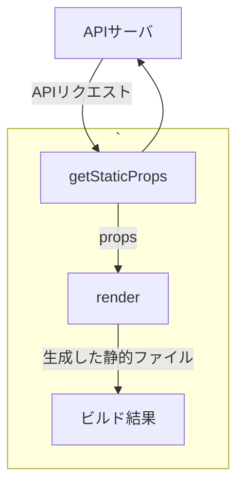
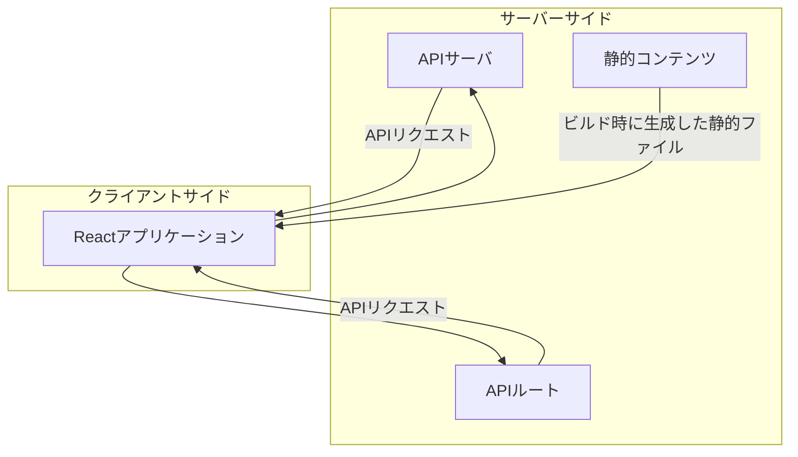

# Next.jsのレンダリング手法
Next.jsではページごとにレンダリング手法を切り替えることができる。

1. 静的サイト生成（SSG: Static Site Generation）
2. クライアントサイドレンダリング(CSR: Client Side Rendering)
3. サーバーサイドレンダリング(SSR: Server Side Rendering)
4. インクリメンタル静的再生成(ISR: Incremental Static Regeneration)

全てのページで、事前レンダリング可能な部分は事前レンダリングを行う。
 
 

## 静的サイト生成（SSG）

SSGではビルド時にAPIなどからデータを取得して、ページを描画して静的ファイルとして生成する。

* ビルド時にgetStaticPropsという関数が呼ばれ、損保関数の中でAPIコールなどを行い、ページの描画に必要なpropsを返す
* このpropsをページコンポーネントに渡して描画
* 描画結果は静的ファイルの形でビルド結果に保存される。
* ブラウザはそれをもとに描画し、初期描画後は普通のReactアプリケーション同様に、APIなどからデータを取得して描画を動的に変化できる。

 
 

 
 
SSGはアクセス時は静的ファイルをクライアントに渡すだけなので初期描画が高速。一方でビルド時のみデータ取得を行うため、初期描画で古いデータが表示される可能性がある。リアルタイム性が求められるようなコンテンツにはあまり適さない。
 
ビルド後に表示内容が変更されないページ、または初期描画以降にデータを表示できるようなページに対してSSGが優れている。パフォーマンスに優れるため、

`Next.jsにおいてはSSRよりSSGが推奨される `
 
 

## クライアントサイドレンダリング（CSR）
* ビルド時にデータ取得を行わず、ページを描画して保存する。
* ブラウザで初期描画した後に非同期でデータを取得して、追加のデータを描画
* ページを描画するのに必要なデータは後から取得して反映するため、SEOにあまり有効ではない

__CSRはSSg, SSR, ISRと組み合わせて利用される。CSRのみの利用はなく、基本的にはSSG, SSR, ISRと組み合わせるものと考える__

* 初期描画がそこまで重要ではなく、リアルタイム性が重要なページに適している。